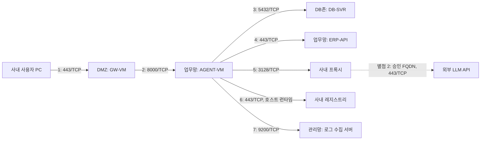

# Day 6 — 방화벽 정책 신청서 연습 초안

작성일: 2026-09-29. 상태: 학습용 초안·검토 중. 고객사 제출·정책 적용·승인 이력 없음.

## 신청 개요

- 용도: AI 에이전트 파일럿.
- 대상 환경: 가상의 온프렘 고객사. 아래 10.x 주소는 가이드 예시이며 실제 고객사 주소나 이번 Docker IP가 아니다.
- 요청자 / 시스템 담당자 / 정책 승인자: 미정.
- 적용 시작일 / 파일럿 종료일: 미정 (`YYYY-MM-DD`). 실제 제출 시 날짜 확정.
- 회수: 파일럿 종료일에 본 신청으로 추가한 정책을 회수하고, 연장은 재신청한다.
- 별첨: 번호를 맞춘 흐름도, 외부 목적지 목록, 최소 권한 근거 및 실습 대조.
- 출발지는 새 연결을 시작하는 주체다. 포트는 목적지 서비스 포트다. 상태 추적 방화벽의 정상 응답 허용과 반대 방향의 새 연결 허용은 구분한다.

## 정책 신청 7행

표는 Day 6 본문의 제안 구조를 부록 E-2 형식에 옮겼다. 포트와 주소는 실제 운영 접점에 맞춰 확정해야 한다.

| # | 출발지 | 목적지 | 목적지 포트/프로토콜 | 용도 | 방향 | 기간 |
|---|---|---|---|---|---|---|
| 1 | 사내 사용자 PC 대역 `10.10.0.0/16` | GW-VM / DMZ `10.1.1.10` | 443/TCP | 사용자 HTTPS 접속 | 사용자망→DMZ | 적용일~파일럿 종료일, 미정 |
| 2 | GW-VM / DMZ `10.1.1.10` | AGENT-VM / 업무망 `10.20.5.11` | 8000/TCP | 게이트웨이가 에이전트에 HTTP 요청 전달 | DMZ→업무망 | 동일 |
| 3 | AGENT-VM / 업무망 `10.20.5.11` | DB-SVR / DB존 `10.30.1.5` | 5432/TCP | 업무 데이터 조회, 읽기 전용 계정 `ro_agent` 예정 | 업무망→DB존 | 동일 |
| 4 | AGENT-VM / 업무망 `10.20.5.11` | ERP-API / 업무망 `10.20.3.20` | 443/TCP | 내부 ERP HTTPS API 조회 | 업무망 내부 | 동일 |
| 5 | AGENT-VM / 업무망 `10.20.5.11` | 사내 프록시 `10.20.0.8` | 3128/TCP | 승인된 외부 LLM API 요청 중계 | 업무망→프록시 | 동일 |
| 6 | AGENT-VM / 업무망 `10.20.5.11` | 사내 레지스트리 `10.20.0.30` | 443/TCP | 호스트의 컨테이너 런타임이 이미지 내려받기 | 업무망 내부 | 동일 |
| 7 | AGENT-VM / 업무망 `10.20.5.11` | 로그 수집 서버 / 관리망 `10.99.1.7` | 9200/TCP | 승인된 감사·운영 로그 전송 | 업무망→관리망 | 동일 |

## 별첨 1 — 연결 흐름도

화살표는 신규 연결을 시작하는 방향이며 번호는 위 신청 행과 같다. 이 그림은 운영 제안이며 현재 Docker 실습에 모든 서비스를 구축했다는 뜻이 아니다.

## 별첨 2 — 프록시 화이트리스트 요청

- 외부 서비스 제공자 / API 용도: 미정.
- 목적지 FQDN: `<실제 LLM API 호스트명>` / 목적지 포트: 443/TCP.
- 추가 인증·리디렉션 목적지 필요 여부: 구현을 확인한 뒤 기재. 실제 목록은 미확정이며 1개라고 단정하지 않는다.
- 사용자 요청·검색 자료 중 외부 전송할 데이터 범위: 미정. 프록시 연결 허용과 데이터 전송 승인은 별도 확인 항목이다.
- 5번은 agent에서 프록시까지의 연결이다. 프록시에서 외부 목적지로 나가는 정책과 FQDN 허용은 별도이며, 기존 고객사 프록시 정책으로 처리 가능한지 확인한다.
- 현재 실습에서는 프록시·LLM 호출을 구성하거나 검증하지 않았다.

## 별첨 3 — 최소 권한 근거

| 행 | 제안 근거 및 확정할 사항 |
|---|---|
| 1 | 합의된 사용자 대역에서 지정 게이트웨이의 443만 허용. 실제 HTTPS 종료 지점이 WAF/LB이면 목적지와 후단 정책을 조정. |
| 2 | 지정 게이트웨이에서 지정 에이전트의 실제 서비스 포트만 허용. 반대 방향 신규 연결을 자동으로 허용하지 않음. |
| 3 | 지정 에이전트에서 지정 DB의 5432만 허용. `ro_agent`에 읽기 전용·대상 스키마 제한 예정. 계정 발급과 SQL 권한 검증은 미실시이며 방화벽만으로 SQL 권한을 제한할 수 없음. |
| 4 | 승인된 ERP API와 조회 권한만 사용. 실제 인증·TLS·포트는 ERP 담당자 확인. |
| 5 | 프록시와 승인 외부 목적지만 허용. agent의 인터넷 직접 연결은 허용 대상으로 신청하지 않음. |
| 6 | 지정 사내 레지스트리만 허용. 이미지 pull 주체는 이 예시에서는 AGENT-VM의 컨테이너 런타임이며 앱 프로세스와 구분. |
| 7 | 지정 로그 수집 서버만 허용. 9200은 가이드 예시이며 실제 수집 프로토콜·포트·TLS·전송 주체·보관 정책 확인 필요. |

DMZ→DB 직접 연결과 DB존→agent의 신규 연결은 이 초안에서 허용 대상으로 신청하지 않는다. 실제 차단 여부는 전체 기존 정책과 적용 후 시험으로 확인한다. 6-2의 DB존→agent 성공은 현재 Docker 연결 구조의 한계이며 위 운영 정책이 이미 적용됐다는 뜻이 아니다.

## 실습 결과와 운영 신청의 구분

| 행 | 이번 실습에서 확인한 것 | 운영 제안에서 추가로 필요한 것 |
|---|---|---|
| 1 | Ubuntu `127.0.0.1:8080`→gateway의 HTTP 요청 성공 | 사용자 대역→실제 GW/WAF/LB 주소, HTTPS 443·인증서·사용자 인증 |
| 2 | gateway→agent:8000의 healthz 응답 | VM 주소와 실제 공개 포트 확인. Docker 내부 8000만으로 VM의 8000이 공개됐다고 볼 수 없음 |
| 3 | agent→postgres:5432 TCP 연결 성공 | DB 계정·인증·스키마 권한·SQL 검증 |
| 4 | agent→erp:8080 HTTP 200 | 실제 ERP의 HTTPS 443·인증·데이터 권한 확인 |
| 5 | 직접 외부 요청 실패, DMZ 추가 시 성공 및 원복 재실패 | 프록시·화이트리스트 구성과 실제 LLM 호출 검증 |
| 6 | 필요한 실습 이미지가 로컬에 존재함 | 사내 레지스트리 연결·인증·이미지 pull 검증 |
| 7 | 이번 절에서 실제 로그 수집 서버로 전송하지 않음 | 로그 수집 경로·프로토콜 및 수신 검증 |

## 원문 차이 및 제출 전 확정 사항

- 본문 6-4의 2번 포트는 8000, 부록 E-2는 8080이다. 이번 초안은 본문·현재 agent 리스너에 맞춰 8000을 예시로 사용했다. 실제 제출은 서버가 외부에 제공하는 접점 기준으로 확정한다.
- 부록 E-2/E-3의 일부 설명은 이후 LLM 게이트웨이 구성을 전제로 한다. 이번에는 Day 6 본문에 맞춰 agent→프록시로 적었다. 이후 게이트웨이를 도입하면 5번 출발지와 흐름도 등을 함께 수정한다.
- IP는 고객사 담당자가 제공한 실제 주소와 방화벽에서 관찰하는 주소로 확정한다. NAT 사용 시 변환 주소, Kubernetes 사용 시 노드/egress 주소를 확인한다. 이번 Docker의 172.21.x·172.22.x를 그대로 신청 주소로 쓰지 않는다.
- 실제 주소, 포트, 적용일·종료일, 담당자, 외부 목적지, 데이터 범위, 계정·로그 정책은 미정이다. 7행은 학습용 범위이며 DNS·인증 등 환경별 추가 통신이 없다는 보장이 아니다.

근거: [Day 6 본문 6-4](../docs/guide/src/07-day06.md), [부록 E-2/E-3](../docs/guide/src/24-appendix-e.md), [실제 실행 기록](SESSION.md).
